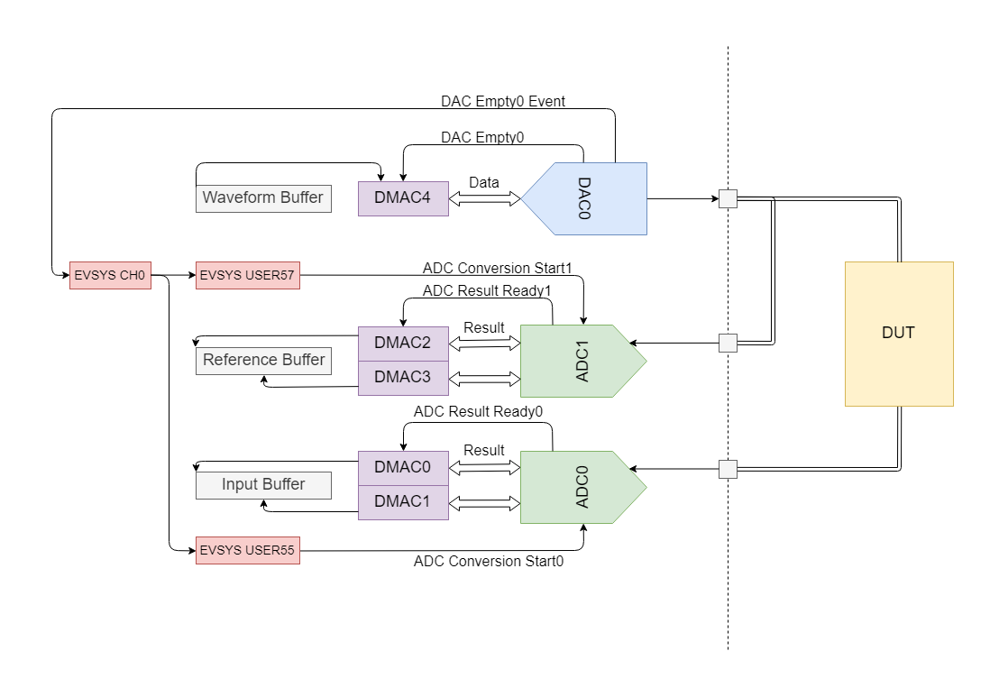

## Frequency Response Analysis on ARM Cortex-M4F

*Submitted as homework [BMEVIMIAV07](https://portal.vik.bme.hu/kepzes/targyak/VIMIAV07/en/)*

**Note:** this is a partial commit, only the code necessary to demonstrate the functionality has been pushed. The project was created on an [ATSAME54-XPRO](https://www.microchip.com/Developmenttools/ProductDetails/ATSAME54-XPRO) development board.

*The diagram above shows how the DUT is stimulated and the data is being acquired.*

The DAC is driven using direct memory access (DMA), the memory content is changed after each frequency step, the data length is also changed so the transaction ends at a zero point then cycles through.

Both ADCs are utilized to capture the reference and input waveforms simultaneously and just like the DAC they use DMA. To enable realtime processing and data acquisition the data is double buffered by using 2 DMA channels.

The ADC conversions are triggered by the DAC Empty interrupt, I used the Event System integrated into the ATSAM series microcontrollers which allows the trigger to be glued to an interrupt without CPU intervention. This way both the DAC and the ADCs are running in sync at 1Msps.

## Results

The main limitation is the waveform output buffer's size, at a constant 1Msps with 512 samples the lowest frequency is going to be around 2kHz and the highest I could push it without distortion was 15.6 kHz. A hybrid solution where the DAC falls back to an interrupt based mode at lower frequencies would be more appropriate.